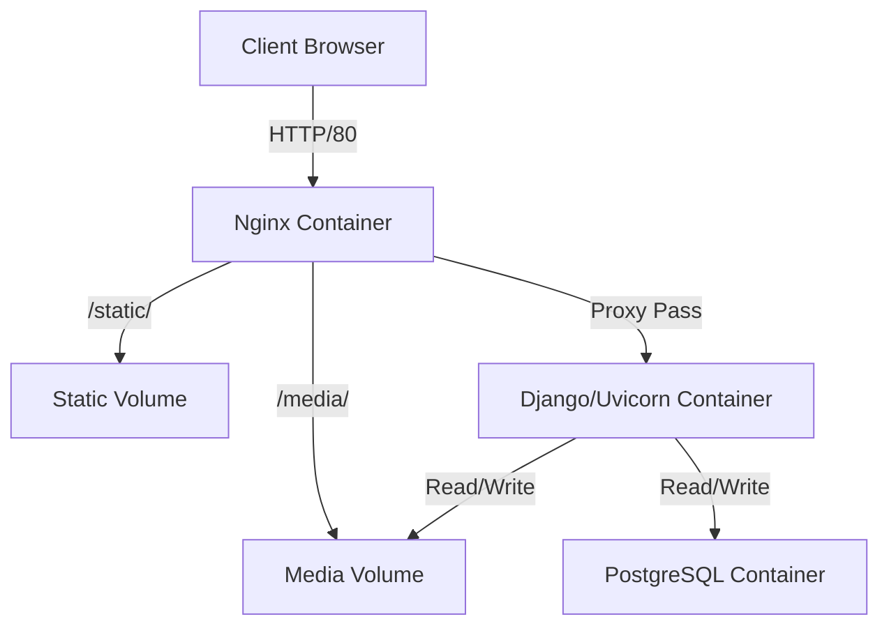

# Docker Migration Plan for Tau Backend

This document outlines the steps to containerize the Tau Django application using Docker, PostgreSQL, and Nginx.

## 1. Overview

We will transition the application from a local environment (SQLite, Dev Server) to a production-ready containerized architecture:

-   **Web Service**: Django application running with Uvicorn (for ASGI/GraphQL support).
-   **Database**: PostgreSQL 15+.
-   **Reverse Proxy**: Nginx to handle static files and forward requests to the application.

## 2. Architecture



## 3. Implementation Steps

### Step 1: Update Dependencies

We need to add production-specific packages to `requirements.txt`.

-   `psycopg2-binary`: PostgreSQL adapter.
-   `gunicorn`: WSGI HTTP Server (optional, but good for managing Uvicorn workers).
-   `uvicorn[standard]`: ASGI Server (already present, but ensuring standard extras).

### Step 2: Create Dockerfile

Create a `Dockerfile` in the root directory to build the Django application image.

-   Base Image: `python:3.12-slim`
-   Work Directory: `/app`
-   Install system dependencies (e.g., `libpq-dev`, `gcc` for building python packages if needed).
-   Install Python dependencies.
-   Copy project code.
-   Collect static files script or entrypoint.

### Step 3: Create Docker Compose Configuration

Create `docker-compose.yml` to orchestrate the services.

-   **db**: PostgreSQL service.
-   **web**: The Django app, depends on `db`.
-   **nginx**: Nginx service, depends on `web`.
-   **Volumes**:
    -   `postgres_data`: Persist database data.
    -   `static_volume`: Share static files between Web and Nginx.
    -   `media_volume`: Share media files between Web and Nginx.

### Step 4: Configure Nginx

Create an `nginx/` directory with a `nginx.conf` or `default.conf`.

-   Serve `/static/` and `/media/` from shared volumes.
-   Proxy other requests to the `web` service on port 8000.

### Step 5: Update Django Settings

Modify `Tau/settings.py` to load configuration from Environment Variables.

-   **SECRET_KEY**: Load from env.
-   **DEBUG**: Load from env (False in production).
-   **ALLOWED_HOSTS**: Load from env.
-   **DATABASES**: Configure to use `POSTGRES_DB`, `POSTGRES_USER`, `POSTGRES_PASSWORD`, `POSTGRES_HOST` (service name `db`).

### Step 6: Environment Configuration

Create a `.env` file (and add it to `.gitignore`) to store sensitive secrets.

-   `POSTGRES_DB`, `POSTGRES_USER`, `POSTGRES_PASSWORD`
-   `DJANGO_SECRET_KEY`, `DJANGO_DEBUG`, `DJANGO_ALLOWED_HOSTS`

### Step 7: Build and Run

-   Run `docker-compose up --build`.
-   Run migrations: `docker-compose exec web python manage.py migrate`.
-   Create superuser: `docker-compose exec web python manage.py createsuperuser`.

## 4. File Structure Changes

```text
Tau/
├── Dockerfile              <-- New
├── docker-compose.yml      <-- New
├── .dockerignore           <-- New
├── .env                    <-- New
├── nginx/                  <-- New Directory
│   └── default.conf        <-- New
├── requirements.txt        <-- Updated
└── Tau/
    └── settings.py         <-- Updated
```
